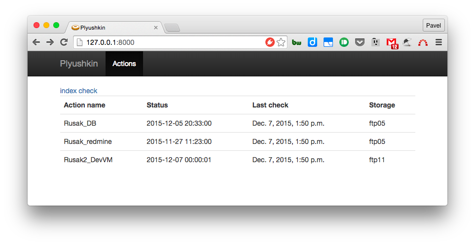

# Plyushkin

Tool for managing backups (monitoring, generating scripts n etc.)
With duplicity in heart, but may be used with any backup tools with supported backends.

#Current status

Usable proof-of-concept
